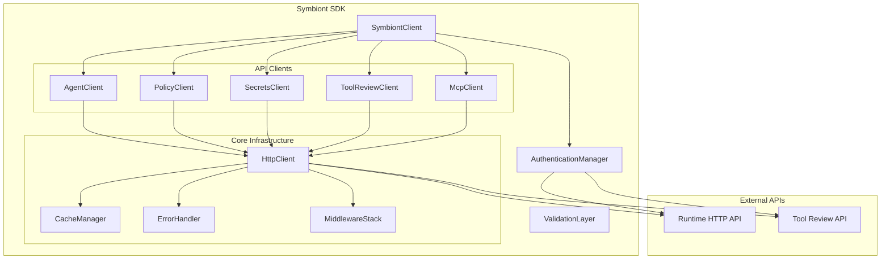
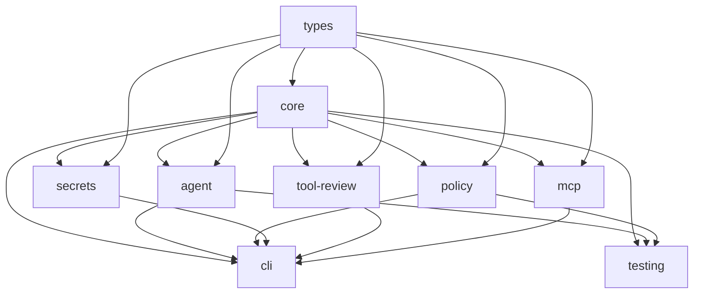
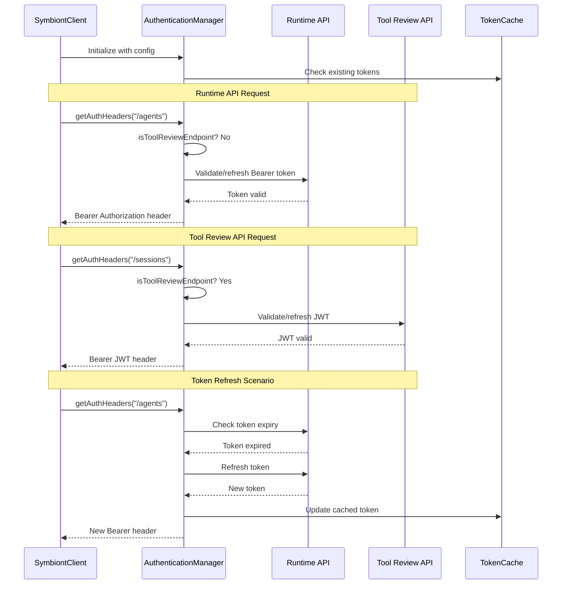

# Symbiont JavaScript SDK - Architectural Design

## Executive Summary

This document outlines the technical architecture for the Symbiont JavaScript/TypeScript SDK, designed to provide a comprehensive, type-safe interface for interacting with both the **Runtime HTTP API** and **Tool Review API**. The architecture emphasizes developer experience, type safety, performance optimization, and intelligent authentication management.

## Core Design Principles

1. **Unified Client Experience**: Single entry point handling dual API systems seamlessly
2. **Intelligent Authentication**: Automatic token management with failover and refresh
3. **Configurable Validation**: Runtime toggle between strict validation and performance modes
4. **Type Safety First**: Full TypeScript support with optional runtime validation
5. **Modular Architecture**: Specialized packages for different concerns
6. **Cross-Platform Support**: Node.js, browsers, and edge environments

## Overall Architecture

### High-Level System Overview



## Package Structure & Monorepo Design

### Refined Package Organization

```
symbiont-sdk-js/
├── packages/
│   ├── core/                    # Core SDK functionality and SymbiontClient
│   ├── types/                   # Shared TypeScript interfaces and Zod schemas
│   ├── agent/                   # Agent management and execution
│   ├── policy/                  # Policy management and validation
│   ├── secrets/                 # Secrets management and encryption
│   ├── tool-review/             # Tool Review API client
│   ├── mcp/                     # MCP client integration
│   ├── cli/                     # Command-line interface
│   └── testing/                 # Testing utilities and mocks
├── apps/
│   ├── docs/                    # Documentation website
│   └── examples/                # Example applications
├── tools/
│   ├── build/                   # Build configuration and scripts
│   ├── lint/                    # Linting configuration
│   └── release/                 # Release management tools
└── configs/
    ├── typescript/              # Shared TypeScript configs
    ├── eslint/                  # Shared ESLint configs
    └── jest/                    # Shared test configs
```

### Package Dependencies



## Core Client Design

### SymbiontClient Architecture

The `SymbiontClient` serves as the unified entry point, managing connections to both APIs through intelligent routing and authentication.

```typescript
export interface SymbiontConfig {
  // API Configuration
  runtimeApiUrl?: string;
  toolReviewApiUrl?: string;
  
  // Authentication
  apiKey?: string;           // For Runtime API
  jwt?: string;              // For Tool Review API
  
  // Validation Mode
  validationMode?: 'strict' | 'performance' | 'development';
  
  // Environment
  environment?: 'development' | 'staging' | 'production';
  
  // Advanced Configuration
  timeout?: number;
  retryConfig?: RetryConfig;
  cacheConfig?: CacheConfig;
  debug?: boolean;
}

export class SymbiontClient {
  private authManager: AuthenticationManager;
  private httpClient: HttpClient;
  private validationLayer: ValidationLayer;
  private cacheManager: CacheManager;
  
  // Lazy-loaded specialized clients
  private _agents?: AgentClient;
  private _policies?: PolicyClient;
  private _secrets?: SecretsClient;
  private _toolReview?: ToolReviewClient;
  private _mcp?: McpClient;
  
  constructor(config: SymbiontConfig) {
    this.authManager = new AuthenticationManager(config);
    this.validationLayer = new ValidationLayer(config.validationMode);
    this.httpClient = new HttpClient(config, this.authManager);
    this.cacheManager = new CacheManager(config.cacheConfig);
  }
  
  // Intelligent API routing
  get agents(): AgentClient {
    return this._agents ??= new AgentClient(this.httpClient, this.validationLayer);
  }
  
  get toolReview(): ToolReviewClient {
    return this._toolReview ??= new ToolReviewClient(this.httpClient, this.validationLayer);
  }
  
  // Health and connectivity
  async connect(): Promise<void>;
  async health(): Promise<HealthStatus>;
}
```

### Authentication Manager Design

The authentication manager handles dual API authentication with automatic token refresh and intelligent failover.

```typescript
export class AuthenticationManager {
  private runtimeAuth: RuntimeAuthHandler;
  private toolReviewAuth: ToolReviewAuthHandler;
  private tokenCache: TokenCache;
  
  constructor(config: SymbiontConfig) {
    this.runtimeAuth = new RuntimeAuthHandler(config.apiKey, config.runtimeApiUrl);
    this.toolReviewAuth = new ToolReviewAuthHandler(config.jwt, config.toolReviewApiUrl);
    this.tokenCache = new TokenCache();
  }
  
  async getAuthHeaders(endpoint: string): Promise<Record<string, string>> {
    if (this.isToolReviewEndpoint(endpoint)) {
      return await this.toolReviewAuth.getHeaders();
    }
    return await this.runtimeAuth.getHeaders();
  }
  
  async refreshTokens(): Promise<void> {
    await Promise.allSettled([
      this.runtimeAuth.refresh(),
      this.toolReviewAuth.refresh()
    ]);
  }
  
  private isToolReviewEndpoint(endpoint: string): boolean {
    return endpoint.includes('/sessions') || endpoint.includes('/tool-review');
  }
}
```

## Data Models & Validation Strategy

### Configurable Validation Layer

```typescript
export type ValidationMode = 'strict' | 'performance' | 'development';

export class ValidationLayer {
  private mode: ValidationMode;
  private schemas: Map<string, z.ZodSchema>;
  
  constructor(mode: ValidationMode = 'development') {
    this.mode = mode;
    this.schemas = new Map();
  }
  
  async validate<T>(data: unknown, schemaKey: string): Promise<T> {
    switch (this.mode) {
      case 'strict':
        return this.strictValidate<T>(data, schemaKey);
      case 'performance':
        return data as T; // Trust TypeScript types
      case 'development':
        return this.developmentValidate<T>(data, schemaKey);
      default:
        return data as T;
    }
  }
  
  private async strictValidate<T>(data: unknown, schemaKey: string): Promise<T> {
    const schema = this.schemas.get(schemaKey);
    if (!schema) {
      throw new ValidationError(`Schema not found: ${schemaKey}`);
    }
    return schema.parseAsync(data) as Promise<T>;
  }
  
  private async developmentValidate<T>(data: unknown, schemaKey: string): Promise<T> {
    try {
      return await this.strictValidate<T>(data, schemaKey);
    } catch (error) {
      console.warn(`Validation warning for ${schemaKey}:`, error);
      return data as T;
    }
  }
}
```

### Shared Type Definitions

```typescript
// Core types with Zod schemas for runtime validation
export const AgentDefinitionSchema = z.object({
  metadata: z.object({
    version: z.string(),
    author: z.string(),
    description: z.string(),
    tags: z.array(z.string()).optional()
  }),
  name: z.string(),
  parameters: z.array(ParameterSchema),
  returnType: TypeDefinitionSchema,
  capabilities: z.array(z.string()),
  policies: z.array(PolicyDefinitionSchema),
  executionConfig: ExecutionConfigSchema,
  dslSource: z.string()
});

export type AgentDefinition = z.infer<typeof AgentDefinitionSchema>;

// Specialized schemas for each API
export const RuntimeApiSchemas = {
  healthCheck: HealthStatusSchema,
  agentExecution: ExecutionResultSchema,
  agentList: z.array(AgentSchema)
};

export const ToolReviewApiSchemas = {
  sessionCreate: SessionCreateResponseSchema,
  sessionList: z.array(SessionSchema),
  toolSubmission: ToolSubmissionResponseSchema
};
```

## API Client Modules Design

### Specialized Client Architecture

Each specialized client focuses on a specific domain while sharing common infrastructure:

```typescript
export abstract class BaseApiClient {
  protected httpClient: HttpClient;
  protected validationLayer: ValidationLayer;
  protected cacheManager: CacheManager;
  
  constructor(
    httpClient: HttpClient, 
    validationLayer: ValidationLayer,
    cacheManager?: CacheManager
  ) {
    this.httpClient = httpClient;
    this.validationLayer = validationLayer;
    this.cacheManager = cacheManager ?? new CacheManager();
  }
  
  protected async request<T>(
    endpoint: string,
    options: RequestOptions,
    schemaKey?: string
  ): Promise<T> {
    // Check cache first
    const cacheKey = this.getCacheKey(endpoint, options);
    const cached = await this.cacheManager.get<T>(cacheKey);
    if (cached) return cached;
    
    // Make request
    const response = await this.httpClient.request<T>(endpoint, options);
    
    // Validate if schema provided
    const validated = schemaKey 
      ? await this.validationLayer.validate<T>(response, schemaKey)
      : response;
    
    // Cache if appropriate
    if (this.isCacheable(endpoint, options)) {
      await this.cacheManager.set(cacheKey, validated);
    }
    
    return validated;
  }
}

export class AgentClient extends BaseApiClient {
  async create(definition: AgentDefinition): Promise<Agent> {
    return this.request<Agent>(
      '/agents',
      { method: 'POST', body: definition },
      'agentCreate'
    );
  }
  
  async execute<T>(
    agentId: string,
    parameters: Record<string, unknown>,
    options?: ExecutionOptions
  ): Promise<ExecutionResult<T>> {
    return this.request<ExecutionResult<T>>(
      `/agents/${agentId}/execute`,
      { method: 'POST', body: { parameters, ...options } },
      'agentExecution'
    );
  }
}

export class ToolReviewClient extends BaseApiClient {
  async createSession(request: SessionCreateRequest): Promise<SessionCreateResponse> {
    return this.request<SessionCreateResponse>(
      '/sessions',
      { method: 'POST', body: request },
      'sessionCreate'
    );
  }
  
  async submitTool(
    sessionId: string,
    tool: ToolSubmission
  ): Promise<ToolSubmissionResponse> {
    return this.request<ToolSubmissionResponse>(
      `/sessions/${sessionId}/tools`,
      { method: 'POST', body: tool },
      'toolSubmission'
    );
  }
}
```

## Error Handling Strategy

### Comprehensive Error Architecture

```typescript
export abstract class SymbiontError extends Error {
  abstract readonly code: string;
  readonly timestamp: Date;
  readonly requestId?: string;
  readonly context?: Record<string, unknown>;
  
  constructor(message: string, context?: Record<string, unknown>) {
    super(message);
    this.name = this.constructor.name;
    this.timestamp = new Date();
    this.context = context;
  }
}

// API-specific errors
export class RuntimeApiError extends SymbiontError {
  readonly code = 'RUNTIME_API_ERROR';
  readonly endpoint: string;
  readonly statusCode: number;
  
  constructor(message: string, endpoint: string, statusCode: number) {
    super(message);
    this.endpoint = endpoint;
    this.statusCode = statusCode;
  }
}

export class ToolReviewApiError extends SymbiontError {
  readonly code = 'TOOL_REVIEW_API_ERROR';
  readonly sessionId?: string;
}

// Authentication errors
export class AuthenticationError extends SymbiontError {
  readonly code = 'AUTHENTICATION_ERROR';
  readonly authType: 'runtime' | 'tool-review';
}

// Validation errors
export class ValidationError extends SymbiontError {
  readonly code = 'VALIDATION_ERROR';
  readonly field?: string;
  readonly validationMode: ValidationMode;
}

// Error handler with automatic retry and fallback
export class ErrorHandler {
  private retryConfig: RetryConfig;
  
  constructor(retryConfig: RetryConfig) {
    this.retryConfig = retryConfig;
  }
  
  async handleError(error: unknown, context: ErrorContext): Promise<never> {
    if (error instanceof AuthenticationError) {
      return this.handleAuthError(error, context);
    }
    
    if (error instanceof ValidationError) {
      return this.handleValidationError(error, context);
    }
    
    if (this.isRetryableError(error)) {
      return this.handleRetryableError(error, context);
    }
    
    throw this.enhanceError(error, context);
  }
  
  private async handleAuthError(error: AuthenticationError, context: ErrorContext): Promise<never> {
    // Attempt token refresh
    if (context.authManager) {
      try {
        await context.authManager.refreshTokens();
        // Retry the original request once
        if (context.retryCount === 0) {
          throw new RetryableError('Auth refresh successful, retry request');
        }
      } catch (refreshError) {
        throw new AuthenticationError('Token refresh failed', error.authType);
      }
    }
    throw error;
  }
}
```

## Request/Response Pipeline & Middleware

### Middleware Architecture

```typescript
export interface Middleware {
  name: string;
  process(context: RequestContext, next: NextFunction): Promise<RequestContext>;
}

export class MiddlewareStack {
  private middlewares: Middleware[] = [];
  
  use(middleware: Middleware): void {
    this.middlewares.push(middleware);
  }
  
  async execute(context: RequestContext): Promise<RequestContext> {
    let index = 0;
    
    const next: NextFunction = async () => {
      if (index >= this.middlewares.length) {
        return context;
      }
      
      const middleware = this.middlewares[index++];
      return middleware.process(context, next);
    };
    
    return next();
  }
}

// Built-in middlewares
export class AuthenticationMiddleware implements Middleware {
  name = 'authentication';
  
  constructor(private authManager: AuthenticationManager) {}
  
  async process(context: RequestContext, next: NextFunction): Promise<RequestContext> {
    const authHeaders = await this.authManager.getAuthHeaders(context.endpoint);
    context.headers = { ...context.headers, ...authHeaders };
    return next();
  }
}

export class ValidationMiddleware implements Middleware {
  name = 'validation';
  
  constructor(private validationLayer: ValidationLayer) {}
  
  async process(context: RequestContext, next: NextFunction): Promise<RequestContext> {
    // Pre-request validation
    if (context.body && context.requestSchemaKey) {
      context.body = await this.validationLayer.validate(
        context.body,
        context.requestSchemaKey
      );
    }
    
    const result = await next();
    
    // Post-response validation
    if (result.response && context.responseSchemaKey) {
      result.response = await this.validationLayer.validate(
        result.response,
        context.responseSchemaKey
      );
    }
    
    return result;
  }
}

export class CacheMiddleware implements Middleware {
  name = 'cache';
  
  constructor(private cacheManager: CacheManager) {}
  
  async process(context: RequestContext, next: NextFunction): Promise<RequestContext> {
    if (context.method === 'GET' && context.cacheable) {
      const cached = await this.cacheManager.get(context.cacheKey);
      if (cached) {
        context.response = cached;
        context.fromCache = true;
        return context;
      }
    }
    
    const result = await next();
    
    if (result.response && context.cacheable && context.method === 'GET') {
      await this.cacheManager.set(context.cacheKey, result.response);
    }
    
    return result;
  }
}
```

### HTTP Client Implementation

```typescript
export class HttpClient {
  private middlewareStack: MiddlewareStack;
  private baseConfig: HttpConfig;
  
  constructor(config: SymbiontConfig, authManager: AuthenticationManager) {
    this.baseConfig = this.buildHttpConfig(config);
    this.middlewareStack = new MiddlewareStack();
    
    // Register default middlewares
    this.middlewareStack.use(new AuthenticationMiddleware(authManager));
    this.middlewareStack.use(new ValidationMiddleware(new ValidationLayer(config.validationMode)));
    this.middlewareStack.use(new CacheMiddleware(new CacheManager(config.cacheConfig)));
    this.middlewareStack.use(new RetryMiddleware(config.retryConfig));
    this.middlewareStack.use(new ErrorHandlingMiddleware());
  }
  
  async request<T>(endpoint: string, options: RequestOptions): Promise<T> {
    const context: RequestContext = {
      endpoint,
      method: options.method || 'GET',
      headers: { ...this.baseConfig.headers, ...options.headers },
      body: options.body,
      timeout: options.timeout || this.baseConfig.timeout,
      requestSchemaKey: options.requestSchemaKey,
      responseSchemaKey: options.responseSchemaKey,
      cacheable: options.cacheable ?? this.isCacheable(endpoint, options),
      cacheKey: this.generateCacheKey(endpoint, options),
      retryCount: 0,
      maxRetries: this.baseConfig.maxRetries
    };
    
    const result = await this.middlewareStack.execute(context);
    
    if (!result.response) {
      throw new Error('Request failed: No response received');
    }
    
    return result.response as T;
  }
}
```

## Authentication Flow Design

### Dual API Authentication Strategy



## Implementation Guidance

### Development Workflow

1. **Package Development Order**:
   - Start with `@symbi/types` for shared interfaces
   - Build `@symbi/core` with basic client functionality
   - Implement specialized clients (`agent`, `tool-review`, etc.)
   - Add advanced features (`mcp`, `secrets`, etc.)
   - Complete with `cli` and `testing` packages

2. **Build Strategy**:
   - Use TypeScript project references for incremental builds
   - Implement rollup for optimized bundling
   - Separate builds for Node.js, browser, and worker environments

3. **Testing Strategy**:
   - Unit tests for each package with Jest
   - Integration tests with real API endpoints
   - E2E tests for complete workflows
   - Browser compatibility testing with Playwright

### Performance Considerations

1. **Lazy Loading**: Specialized clients are instantiated only when accessed
2. **Intelligent Caching**: Configurable cache with TTL and invalidation strategies
3. **Request Batching**: Combine multiple requests where possible
4. **Connection Pooling**: Reuse HTTP connections for better performance
5. **Tree Shaking**: Ensure only used code is included in final bundles

## Deployment & Distribution

### Build Targets

- **Node.js**: CommonJS and ESM builds for server environments
- **Browser**: Optimized bundle with WebCrypto API usage
- **Web Workers**: Specialized build for background processing
- **CDN**: Standalone builds for direct browser inclusion

### Publishing Strategy

- Individual package publishing to npm
- Coordinated releases using Lerna or similar tools
- Semantic versioning with automated changelog generation
- Documentation deployment to dedicated site

This architectural design provides a solid foundation for building a robust, performant, and developer-friendly SDK for the Symbiont platform.