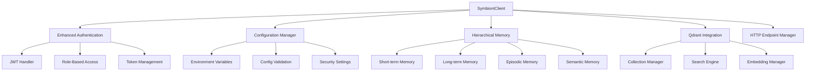
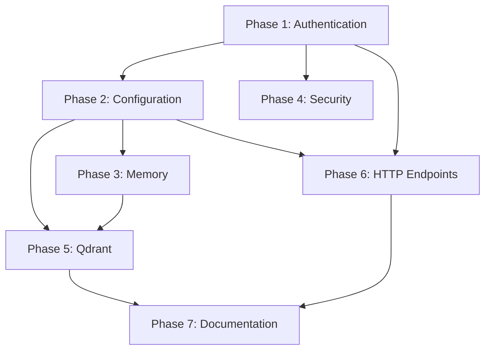

# Symbiont SDK JavaScript v0.3.1 Update Implementation Plan

## Overview

This document provides a comprehensive implementation plan for updating the `symbiont-sdk-js` to align with the Python SDK v0.3.1 features and capabilities. This update represents a major version with breaking changes that introduce significant new functionality.

**Approach**: Clean break with comprehensive migration documentation (no backward compatibility)

**Priority Order**: Authentication → Configuration → Memory → Security → Vector DB → HTTP Endpoints → Documentation/Metrics

## Architecture Overview



## Implementation Phases

### Phase 1: Enhanced Authentication System (High Priority)

**Timeline**: 2-3 weeks  
**Dependencies**: None

#### New Components to Implement:

1. **AuthManager Class** (`packages/core/src/auth/AuthManager.ts`)
   - [ ] Central authentication management
   - [ ] JWT access and refresh token handling
   - [ ] Role-based access control coordination
   - [ ] Token validation and blacklisting

2. **JWTHandler Class** (`packages/core/src/auth/JWTHandler.ts`)
   - [ ] JWT encoding/decoding with proper typing
   - [ ] Token refresh mechanism
   - [ ] Expiration handling
   - [ ] Signature validation

3. **Role & Permission Models** (`packages/types/src/auth.ts`)
   ```typescript
   interface Role {
     id: string;
     name: string;
     permissions: Permission[];
     description?: string;
   }
   
   interface Permission {
     id: string;
     resource: string;
     action: string;
     scope?: string;
   }
   
   interface AuthUser {
     id: string;
     email: string;
     roles: Role[];
     metadata?: Record<string, any>;
   }
   ```

4. **TokenValidator Class** (`packages/core/src/auth/TokenValidator.ts`)
   - [ ] Constant-time token comparison (security enhancement)
   - [ ] Token blacklist management
   - [ ] Validation rules engine

5. **AuthToken Model** (`packages/types/src/auth.ts`)
   ```typescript
   interface AuthToken {
     accessToken: string;
     refreshToken: string;
     expiresAt: Date;
     tokenType: 'Bearer';
     scope?: string[];
     metadata?: Record<string, any>;
   }
   ```

#### Files to Modify:
- [ ] `packages/core/src/auth.ts` → Refactor to use new AuthManager
- [ ] `packages/core/src/client.ts` → Update to use enhanced authentication
- [ ] `packages/types/src/auth.ts` → Add new interfaces and types

#### Breaking Changes:
- [ ] Authentication flow now requires explicit role/permission management
- [ ] Token refresh is now automatic and transparent
- [ ] API key authentication is deprecated in favor of JWT

### Phase 2: Configuration Management Updates (High Priority)

**Timeline**: 1-2 weeks  
**Dependencies**: Phase 1 (for security configurations)

#### New Components to Implement:

1. **Enhanced Configuration Classes** (`packages/core/src/config/`)
   - [ ] `ClientConfig.ts` - Enhanced client configuration
   - [ ] `AuthConfig.ts` - Authentication-specific settings
   - [ ] `VectorConfig.ts` - Vector database configuration
   - [ ] `DatabaseConfig.ts` - Database connection settings
   - [ ] `LoggingConfig.ts` - Logging configuration

2. **Environment Variable Support** (`packages/core/src/config/EnvManager.ts`)
   - [ ] Automatic environment variable loading with `SYMBIONT_` prefix
   - [ ] Type validation for environment variables
   - [ ] Default value handling
   - [ ] Configuration validation with Zod schemas

3. **Configuration Schema Updates** (`packages/types/src/config.ts`)
   ```typescript
   interface EnhancedSymbiontConfig {
     // Core settings
     client: ClientConfig;
     auth: AuthConfig;
     vector?: VectorConfig;
     database?: DatabaseConfig;
     logging?: LoggingConfig;
     
     // Environment support
     environment: 'development' | 'staging' | 'production';
     debug: boolean;
   }
   ```

#### Files to Modify:
- [ ] `packages/types/src/config.ts` → Restructure for nested configuration
- [ ] `packages/core/src/client.ts` → Update configuration handling
- [ ] All package configurations → Update to use new structure

#### Breaking Changes:
- [ ] Configuration structure is now nested by component
- [ ] Environment variables are automatically loaded
- [ ] Some configuration options have been renamed or moved

### Phase 3: Hierarchical Memory System (High Priority)

**Timeline**: 3-4 weeks  
**Dependencies**: Phase 2 (for configuration)

#### New Components to Implement:

1. **Memory Core** (`packages/memory/` - New Package)
   - [ ] `MemoryManager.ts` - Main memory management interface
   - [ ] `MemoryNode.ts` - Individual memory item model
   - [ ] `HierarchicalMemory.ts` - Multi-level memory architecture

2. **Memory Levels** (`packages/memory/src/levels/`)
   - [ ] `ShortTermMemory.ts` - Recent interactions, limited capacity
   - [ ] `LongTermMemory.ts` - Persistent important information
   - [ ] `EpisodicMemory.ts` - Event-based contextual memory
   - [ ] `SemanticMemory.ts` - Fact-based knowledge memory

3. **Storage Backends** (`packages/memory/src/storage/`)
   - [ ] `MemoryStore.ts` - Abstract storage interface
   - [ ] `InMemoryStore.ts` - In-memory storage for development
   - [ ] `RedisMemoryStore.ts` - Redis backend with TTL support

4. **Memory Types** (`packages/types/src/memory.ts`)
   ```typescript
   enum MemoryLevel {
     SHORT_TERM = 'short_term',
     LONG_TERM = 'long_term',
     EPISODIC = 'episodic',
     SEMANTIC = 'semantic'
   }
   
   interface MemoryNode {
     id: string;
     content: any;
     level: MemoryLevel;
     timestamp: Date;
     accessCount: number;
     importance: number;
     tags?: string[];
     metadata?: Record<string, any>;
   }
   ```

#### Files to Create:
- [ ] `packages/memory/package.json`
- [ ] `packages/memory/src/index.ts`
- [ ] `packages/memory/tsconfig.json`
- [ ] Memory implementation files as listed above

#### Integration Points:
- [ ] Update `packages/core/src/client.ts` to include memory management
- [ ] Add memory configuration to main config
- [ ] Create memory-related types in types package

### Phase 4: Security Enhancements (High Priority)

**Timeline**: 1-2 weeks  
**Dependencies**: Phase 1 (Authentication), Phase 2 (Configuration)

#### New Components to Implement:

1. **Security Manager** (`packages/core/src/security/SecurityManager.ts`)
   - [ ] Centralized security policy enforcement
   - [ ] Timing attack prevention utilities
   - [ ] Security audit logging

2. **Constant-Time Operations** (`packages/core/src/security/CryptoUtils.ts`)
   - [ ] Constant-time string comparison (equivalent to Python's `subtle` crate)
   - [ ] Secure random generation
   - [ ] Hash verification utilities

3. **Security Configuration** (`packages/core/src/security/SecurityConfig.ts`)
   - [ ] Security policy definitions
   - [ ] Threat detection settings
   - [ ] Audit configuration

#### Files to Modify:
- [ ] `packages/core/src/auth/TokenValidator.ts` → Use constant-time comparisons
- [ ] `packages/core/src/client.ts` → Integrate security manager
- [ ] Add security types to `packages/types/src/security.ts`

### Phase 5: Qdrant Vector Database Integration (Medium Priority)

**Timeline**: 2-3 weeks  
**Dependencies**: Phase 2 (Configuration), Phase 3 (Memory - for vector storage)

#### New Components to Implement:

1. **Qdrant Core** (`packages/qdrant/` - New Package)
   - [ ] `QdrantManager.ts` - Core Qdrant operations
   - [ ] `CollectionManager.ts` - Collection lifecycle management
   - [ ] `VectorOperations.ts` - CRUD operations for vectors
   - [ ] `SearchEngine.ts` - Semantic search implementation

2. **Embedding Management** (`packages/qdrant/src/embeddings/`)
   - [ ] `EmbeddingManager.ts` - Embedding generation and storage
   - [ ] Support for multiple embedding providers (OpenAI, HuggingFace, etc.)

3. **Vector Types** (`packages/types/src/vector.ts`)
   ```typescript
   interface VectorPoint {
     id: string;
     vector: number[];
     payload?: Record<string, any>;
   }
   
   interface SearchResult {
     id: string;
     score: number;
     payload?: Record<string, any>;
   }
   
   interface Collection {
     name: string;
     dimension: number;
     distance: 'Cosine' | 'Dot' | 'Euclid';
     config?: Record<string, any>;
   }
   ```

#### Files to Create:
- [ ] `packages/qdrant/package.json`
- [ ] `packages/qdrant/src/index.ts`
- [ ] `packages/qdrant/tsconfig.json`
- [ ] Qdrant implementation files as listed above

### Phase 6: HTTP Endpoint Management (Medium Priority)

**Timeline**: 2 weeks  
**Dependencies**: Phase 1 (Authentication), Phase 2 (Configuration)

#### New Components to Implement:

1. **Endpoint Manager** (`packages/core/src/http/EndpointManager.ts`)
   - [ ] Dynamic endpoint creation
   - [ ] Endpoint lifecycle management
   - [ ] Route registration and handling

2. **HTTP Models** (`packages/types/src/http.ts`)
   ```typescript
   interface HttpEndpointCreateRequest {
     path: string;
     method: HttpMethod;
     handler: string;
     middleware?: string[];
     auth?: AuthRequirement;
   }
   
   interface HttpEndpointInfo {
     id: string;
     path: string;
     method: HttpMethod;
     status: 'active' | 'inactive';
     metrics: EndpointMetrics;
   }
   
   interface EndpointMetrics {
     requestCount: number;
     averageResponseTime: number;
     errorRate: number;
     lastAccessed: Date;
   }
   ```

3. **HTTP Method Enum** (`packages/types/src/http.ts`)
   ```typescript
   enum HttpMethod {
     GET = 'GET',
     POST = 'POST',
     PUT = 'PUT',
     DELETE = 'DELETE',
     PATCH = 'PATCH',
     OPTIONS = 'OPTIONS',
     HEAD = 'HEAD'
   }
   ```

### Phase 7: Documentation and Metrics (Low Priority)

**Timeline**: 1-2 weeks  
**Dependencies**: All previous phases

#### Components to Implement:

1. **API Documentation Integration**
   - [ ] SwaggerUI setup for dynamic endpoint documentation
   - [ ] Auto-generated OpenAPI specifications
   - [ ] Interactive API explorer

2. **Advanced Metrics**
   - [ ] Performance monitoring
   - [ ] Usage analytics
   - [ ] Health check endpoints

## Breaking Changes and Migration Guide

### Configuration Changes

**Before (v1.x):**
```typescript
const config = {
  runtimeApiUrl: 'https://api.example.com',
  apiKey: 'your-key',
  timeout: 30000
};
```

**After (v0.3.1):**
```typescript
const config = {
  client: {
    runtimeApiUrl: 'https://api.example.com',
    timeout: 30000
  },
  auth: {
    strategy: 'jwt',
    jwt: {
      accessToken: 'your-jwt-token',
      refreshToken: 'your-refresh-token'
    }
  },
  environment: 'production'
};
```

### Authentication Changes

**Before (v1.x):**
```typescript
// Simple API key or JWT
const client = new SymbiontClient({ apiKey: 'key' });
```

**After (v0.3.1):**
```typescript
// Role-based authentication with permissions
const client = new SymbiontClient(config);
await client.auth.authenticate({
  credentials: { username: 'user', password: 'pass' },
  requiredRoles: ['admin', 'user']
});
```

### Memory System (New Feature)

**New in v0.3.1:**
```typescript
// Hierarchical memory management
await client.memory.store({
  content: 'Important information',
  level: MemoryLevel.LONG_TERM,
  tags: ['important', 'user-data']
});

const memories = await client.memory.search({
  query: 'user preferences',
  level: MemoryLevel.SEMANTIC,
  limit: 10
});
```

## Implementation Dependencies



## Testing Strategy

### Unit Tests
- [ ] Comprehensive test coverage for all new components
- [ ] Mock external dependencies (Qdrant, Redis, etc.)
- [ ] Security testing for constant-time operations

### Integration Tests
- [ ] End-to-end authentication flows
- [ ] Memory system integration with different storage backends
- [ ] Qdrant integration with real vector operations

### Performance Tests
- [ ] Memory system performance under load
- [ ] Vector search performance benchmarks
- [ ] Authentication overhead measurements

## Deployment Considerations

### Package Structure Updates
- New packages: `@symbiont/memory`, `@symbiont/qdrant`
- Updated packages: `@symbiont/core`, `@symbiont/types`
- Dependency updates: Add Redis client, Qdrant client

### Environment Variables
```bash
# Authentication
SYMBIONT_AUTH_JWT_SECRET=your-secret
SYMBIONT_AUTH_REFRESH_SECRET=your-refresh-secret

# Memory System
SYMBIONT_MEMORY_BACKEND=redis
SYMBIONT_REDIS_URL=redis://localhost:6379

# Vector Database
SYMBIONT_QDRANT_URL=http://localhost:6333
SYMBIONT_QDRANT_API_KEY=your-qdrant-key

# Security
SYMBIONT_SECURITY_AUDIT_ENABLED=true
SYMBIONT_SECURITY_TIMING_ATTACK_PREVENTION=true
```

## Success Criteria

### Phase 1 Success Criteria:
- [ ] JWT authentication with refresh tokens working
- [ ] Role-based access control implemented
- [ ] Constant-time token validation
- [ ] All authentication tests passing

### Phase 2 Success Criteria:
- [ ] Environment variable configuration working
- [ ] Nested configuration structure implemented
- [ ] Configuration validation with proper error messages
- [ ] Migration from old config format documented

### Phase 3 Success Criteria:
- [ ] All four memory levels implemented and working
- [ ] Memory storage backends (in-memory and Redis) functional
- [ ] Memory search and retrieval operations working
- [ ] Performance benchmarks meet requirements

### Phase 4 Success Criteria:
- [ ] Security manager integrated
- [ ] Timing attack prevention verified
- [ ] Security audit logging functional
- [ ] Security tests passing

### Phase 5 Success Criteria:
- [ ] Qdrant integration working with real collections
- [ ] Vector search operations functional
- [ ] Embedding management working
- [ ] Performance meets benchmarks

### Phase 6 Success Criteria:
- [ ] Dynamic endpoint creation working
- [ ] Endpoint metrics collection functional
- [ ] HTTP endpoint management API complete
- [ ] Integration with authentication system

### Overall Success Criteria:
- [ ] All breaking changes documented with migration paths
- [ ] Performance is equal or better than v1.x
- [ ] Test coverage >= 90%
- [ ] Documentation complete and accurate
- [ ] Zero security vulnerabilities in security scan

## Timeline Summary

| Phase | Duration | Parallel Work Possible |
|-------|----------|----------------------|
| Phase 1: Authentication | 2-3 weeks | No dependencies |
| Phase 2: Configuration | 1-2 weeks | Can start after Phase 1 week 1 |
| Phase 3: Memory | 3-4 weeks | Can start after Phase 2 |
| Phase 4: Security | 1-2 weeks | Can start after Phase 1 |
| Phase 5: Qdrant | 2-3 weeks | Can start after Phase 2 & 3 |
| Phase 6: HTTP Endpoints | 2 weeks | Can start after Phase 1 & 2 |
| Phase 7: Documentation | 1-2 weeks | Can start after all phases |

**Total Estimated Timeline**: 8-12 weeks with parallel development

## Risk Mitigation

### High Risk Areas:
1. **Memory System Complexity** - Implement incrementally, start with simple in-memory storage
2. **Qdrant Integration** - Create abstraction layer to allow for alternative vector databases
3. **Security Implementation** - Thorough security review and penetration testing
4. **Performance Regression** - Continuous benchmarking throughout development

### Mitigation Strategies:
- Prototype complex features before full implementation
- Regular security audits during development
- Performance testing at each phase
- Rollback plans for each major change

---

*This implementation plan provides a comprehensive roadmap for updating the symbiont-sdk-js to v0.3.1 feature parity with the Python SDK. Each phase can be implemented incrementally with clear success criteria and migration paths.*